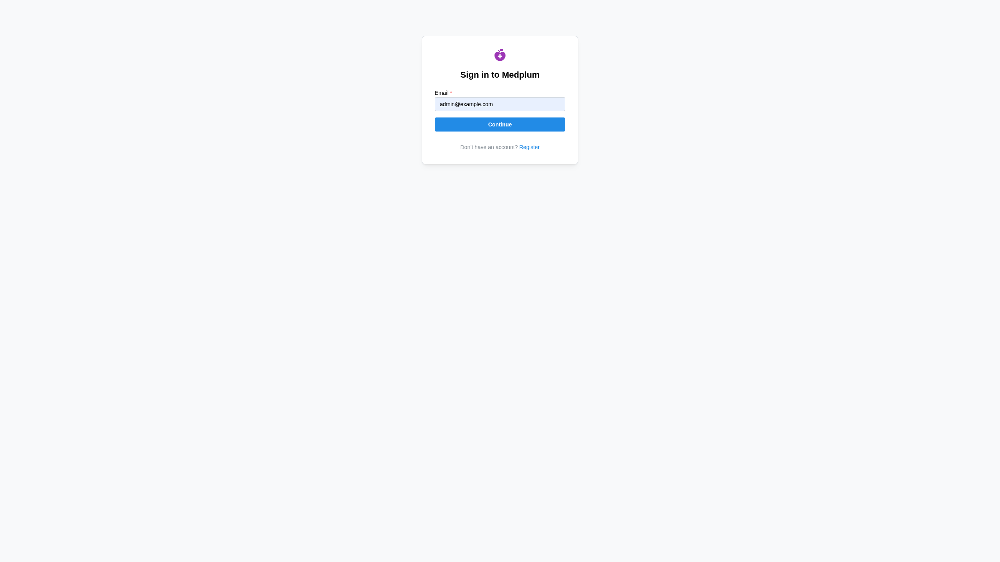
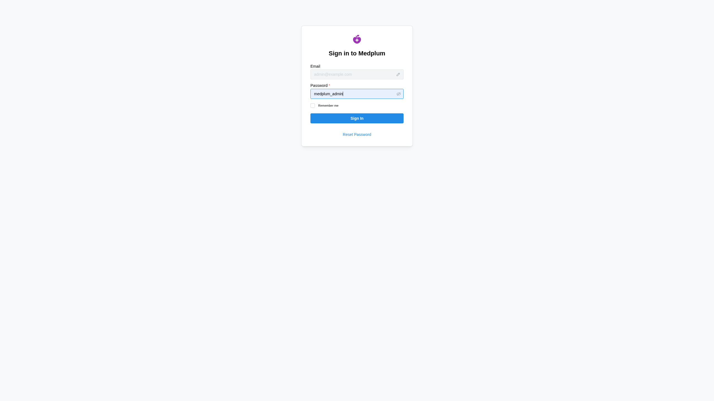
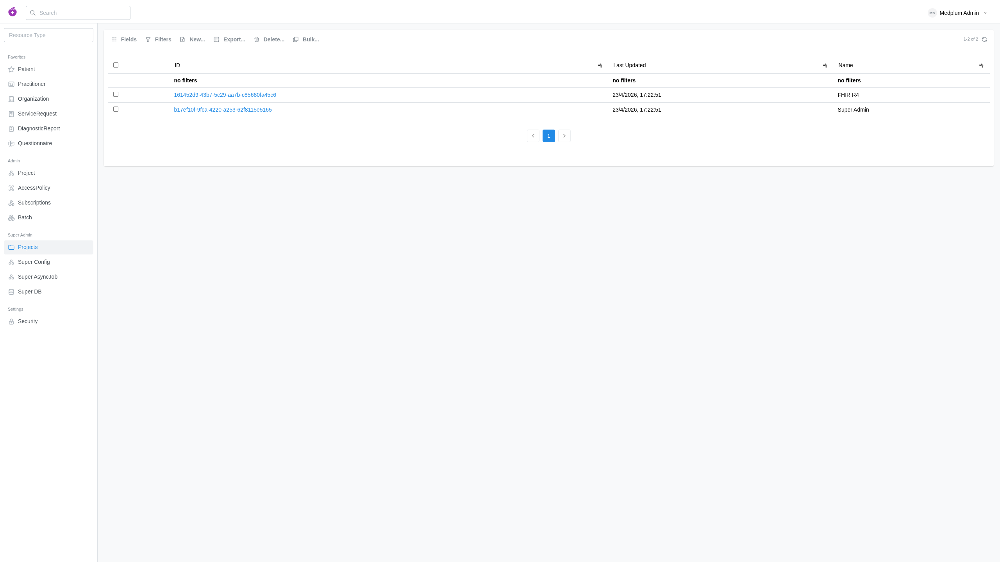
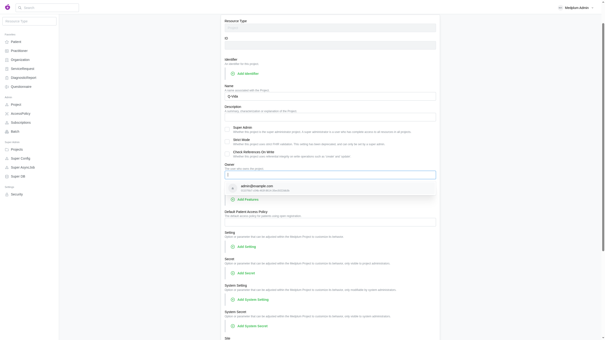
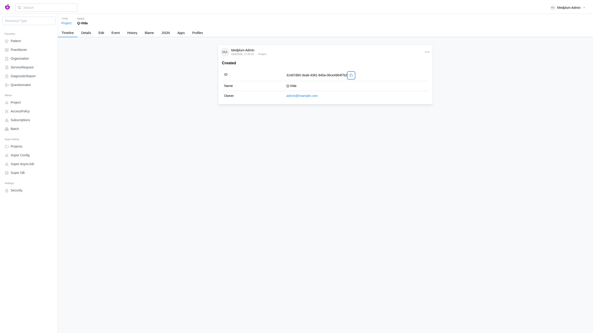
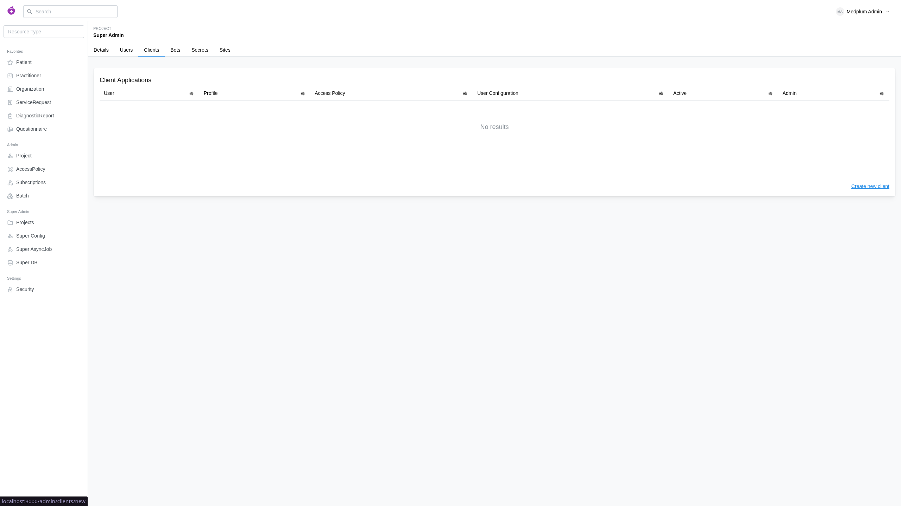
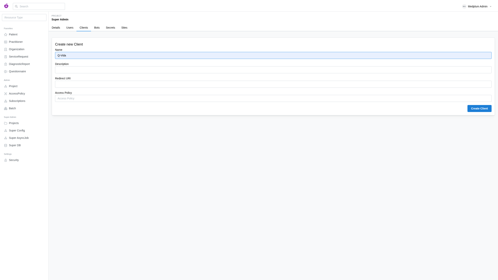
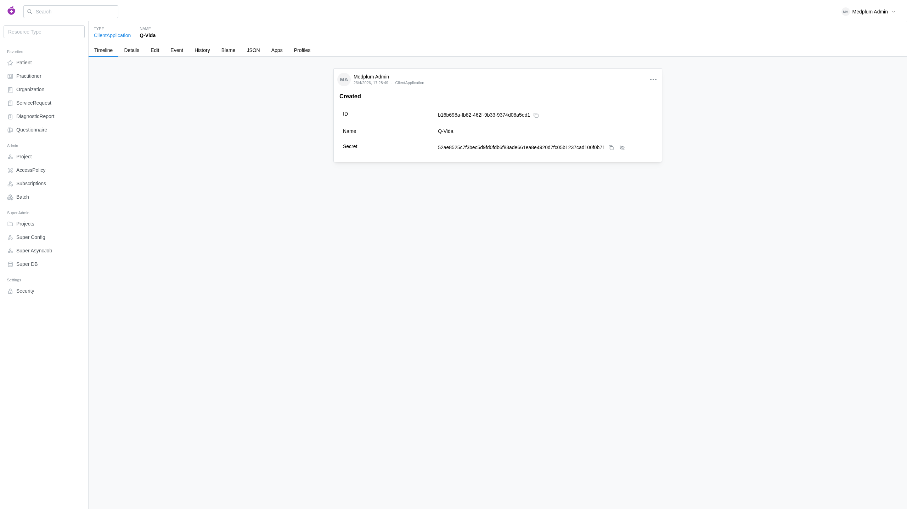

# Medplum

## Medplum docker compose
https://www.medplum.com/docs/self-hosting/running-full-medplum-stack-in-docker

**TODO**: move .env vars to .env file instead of hardcode it on docker-compose.yml (to improve security)

## Generate a medplum project

### Sesion



### New project




#### Set .env var (our backend .env)
```shell
MEDPLUM_PROJECT_ID=31497d60-3ea6-4381-840a-06ce4964f7b2
```
### New client




#### Set .env vars (our backend .env)
```shell
MEDPLUM_URL=http://localhost:8103
MEDPLUM_CLIENT_ID=b16b698a-fb82-462f-9b33-9374d08a5ed1
MEDPLUM_CLIENT_SECRET=52ae8525c7f3bec5d9fd0fdb6f83ade661ea8e4920d7fc05b1237cad100f0b71
```
